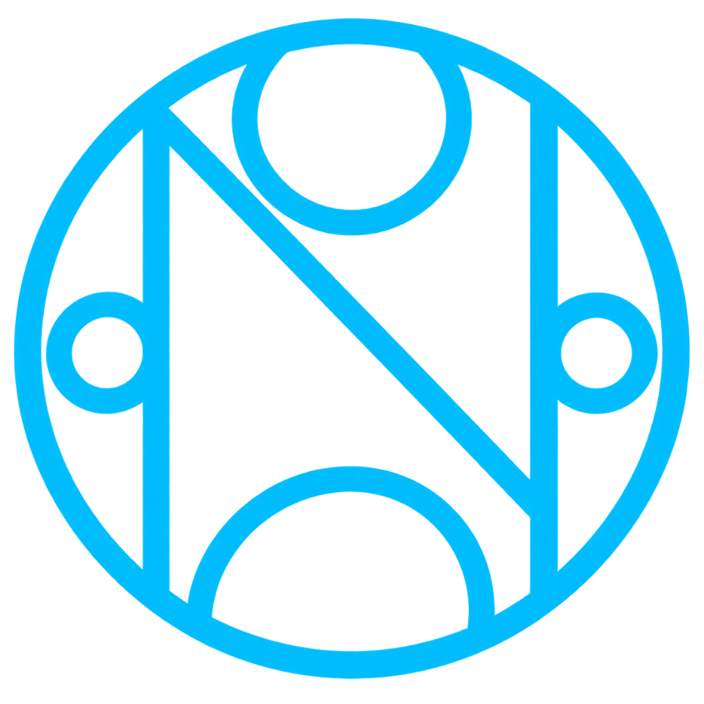
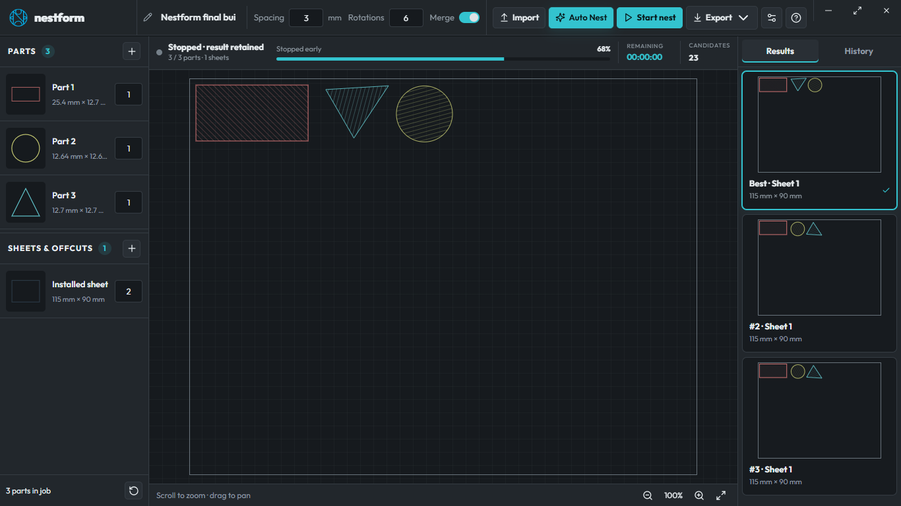

<p align="center">
  
</p>

<p align="center">
  A modern Windows nesting workspace for laser cutting and CNC, powered by the preserved Deepnest engine.
</p>

<p align="center">
  <a href="https://github.com/YazeKT/Nestform/actions/workflows/ci.yml"></a>
  <a href="https://github.com/YazeKT/Nestform/actions/workflows/codeql.yml"></a>
  <a href="https://github.com/YazeKT/Nestform/releases/latest"></a>
  <a href="LICENSE"></a>
</p>



## What Nestform does

Nestform imports scaled SVG parts, assigns quantities, and searches across full sheets and offcuts for efficient layouts. Auto Nest provides the recommended workflow: import parts, enter stock dimensions and quantity, then start with an exact 3 mm gap and six evenly spaced rotations. The desktop interface includes live progress, multiple result previews, local history, repeat export, saved backups, appearance controls, and an in-app user and technical guide.

- Local SVG processing and nesting
- Multiple sheets and offcuts with independent quantities
- Millimetre-based input and physical-size SVG export
- Colour-coded parts from inventory through result and history previews
- Exact-result history with optional user-selected backup folder
- OLED black, dark grey, and light themes
- Windows installer and portable executable

## Install on Windows

Download the installer from the [latest GitHub release](https://github.com/YazeKT/Nestform/releases/latest) and run `Nestform-Setup-0.4.0.exe`. A portable executable is supplied beside it.

The 0.4.0 binaries are not Authenticode signed. Windows may display an **Unknown publisher** or Microsoft Defender SmartScreen message. Verify the downloaded file against `SHA256SUMS.txt` in the same release.

## Millimetres and manufacturing limits

Nestform preserves the original engine's internal coordinate model and performs unit conversion at the import and export boundaries. The test fixture reopens at the requested stock size and measured a requested 5 mm clearance within floating-point residue below one millionth of a millimetre. This validates the tested SVG path; it is not a calibration certificate for every CAD exporter, curve approximation, controller, kerf, or machine.

Always inspect the exported drawing, confirm units and dimensions in the receiving software, and run a safe material test before production. See [Safety](docs/SAFETY.md) and the [User guide](docs/USER-GUIDE.md).

## Privacy and storage

SVG nesting runs locally. Nestform has no user account, telemetry, cloud history, or automatic updater. Settings and completed History records are stored in Electron's local application-data folder. If the user chooses a history backup folder, Nestform writes completed SVG output and job metadata there.

DXF and CDR import and DXF export depend on the configured conversion service and require confirmation. Conversion failures are reported separately from nesting failures.

## Build from source

Requirements:

- Windows 10 or 11, x64
- Node.js 22 or newer
- Visual Studio 2022 C++ build tools and Windows SDK
- Python supported by `node-gyp`
- Windows `tar` or 7-Zip

```powershell
git clone https://github.com/YazeKT/Nestform.git
cd Nestform
npm ci
npm run runtime:install
npm run bootstrap:win
npm run native:build
npm run verify
npm run dev
```

`bootstrap:win` downloads Boost 1.62 from the official archive, verifies its pinned SHA-256 checksum, and extracts it locally. Downloaded Boost files, native output, release packages, and runtime data are excluded from Git.

See [Building](docs/BUILDING.md), [Architecture](docs/ARCHITECTURE.md), and [Troubleshooting](docs/TROUBLESHOOTING.md).

## Deepnest origin and licence

Nestform is a desktop fork of [Deepnest by Jack Qiao](https://github.com/Jack000/Deepnest), which in turn is based on [SVGNest](https://github.com/Jack000/SVGnest). The SVG parser, geometry helpers, placement search, line merging, export behavior, and Boost polygon convolution remain attributed to their original authors.

The combined program is distributed under **GPL-3.0-only**. Distributed modified versions must remain under the GPL and provide complete corresponding source. The licence permits use, modification, redistribution, and commercial distribution; it does not transfer ownership of the Nestform or Yaze Media branding. See [LICENSE](LICENSE), [Copyright](COPYRIGHT.md), [Third-party notices](THIRD-PARTY-NOTICES.md), and [Brand usage](BRAND-USAGE.md).

The Nestform name remains provisional and is not represented as a registered trade mark. See [Name-clearance status](docs/NAME-CLEARANCE.md).

## Contributing and support

Read [Contributing](CONTRIBUTING.md) before opening a pull request. Contributions use GPL-3.0-only and require a Developer Certificate of Origin sign-off. Use GitHub Issues for reproducible bugs and feature proposals, Discussions for questions, and GitHub's private vulnerability reporting for security problems.

General support: [kirstentrimaley@gmail.com](mailto:kirstentrimaley@gmail.com)

Nestform is maintained by **Kirsten Trimaley, trading as Yaze Media**.
